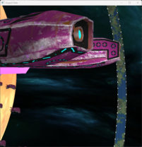
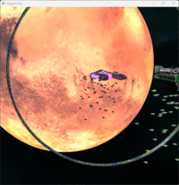
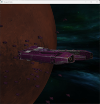
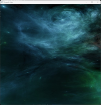

# Halo OpenGl

This is an OpenGl sample inspired in Halo and the knowledge from [learnopengl.com](https://learnopengl.com) tutorials.

## How to run

It is only for Windows and you can find the executable [here](src/x64/Debug/).

## How to build

You must have Visual Studio and CMake installed. I recommend you to follow this [tutorial](https://www.youtube.com/watch?v=HzFatL3WT6g) to install CMake and Visual Studio.

## Screenshots

Hope you take advantage of this sample. 😊
